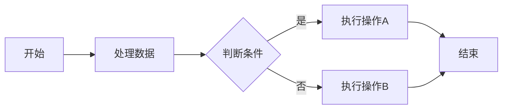
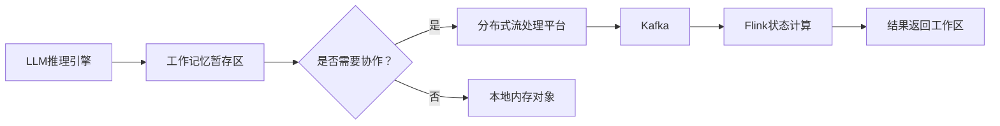
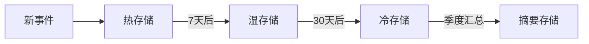
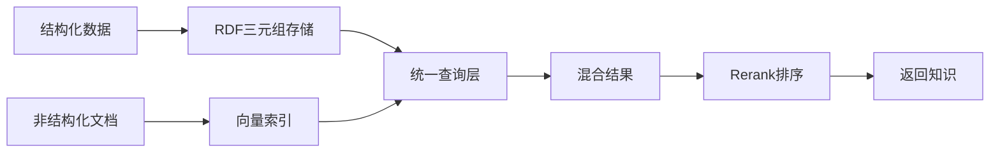
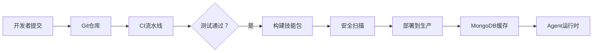
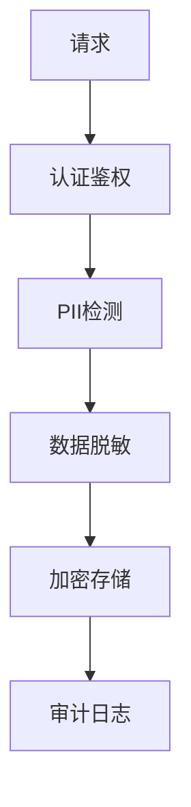

# Agent的“记忆宫殿”：六层记忆系统的工程化存储设计  
## 从认知模型到生产级架构的深度实践  

**引言**  
人类依靠短期记忆对话、长期记忆沉淀经验、肌肉记忆自动执行动作。LLM Agent同样需要分层记忆系统来实现连贯交互、个性化响应和复杂任务执行。本文将拆解Agent的六类核心记忆（短期/工作/情节/语义/长期/程序性），并深入探讨其**工程落地的存储架构设计**——如何为每类记忆选择合适的数据库、数据模型及运维策略，最终构建统一高效的记忆编排层。

---

## 一、六类记忆：从认知模型到技术定义

| 记忆类型               | 核心作用                          | 生命周期       | 典型场景                     |
|------------------------|-----------------------------------|------------|--------------------------|
| **短期记忆(STM)**       | 临时保存对话上下文                | 秒~分钟(单轮对话) | 聊天中的最近3轮消息               |
| **工作记忆(WM)**        | 实时推理的“草稿纸”                | 秒~小时       | 多步骤任务中的**中间状态**          |
| **情节记忆(Episodic)**  | 记录事件细节（Who/When/What）     | 天~年        | “上周和用户A讨论过机票退款” **事件记录** |
| **语义记忆(Semantic)**  | 存储事实与概念知识                | 永久（动态更新）   | “巴黎是法国首都”                |
| **长期记忆(LTM)**       | 用户偏好与历史知识聚合体          | 永久         | 用户饮食偏好、公司产品文档            |
| **程序性记忆(Procedural)**| 自动化技能库                    | 永久         | 自动发送周报的脚本                |

> **关键洞察**：记忆分层本质是**数据访问模式的分层**——按延迟要求、持久性、查询方式分离存储。

---

## 二、存储选型实战：为每类记忆匹配最佳引擎

### 1. 短期记忆(STM)：毫秒级瞬态缓存
```python
# 单实例：Python Dict（轻量）
stm_cache = {
    "session_id": [
        {"role": "user", "content": "Hello", "ts": 1718870400},
        {"role": "assistant", "content": "Hi there!", "ts": 1718870405}
    ]
}

# 分布式：Redis Cluster（高并发）
redis_client.setex(
    name=f"stm:{session_id}", 
    time=300,  # TTL=5分钟
    value=json.dumps(messages)
)
```
### 设计要点：

- TTL策略：必须 ≤ LLM上下文窗口（防跨会话泄露）

- 性能优化：禁用持久化（AOF/RDB）换取亚毫秒延迟

- 向量扩展：附加轻量Faiss索引支持临时语义搜索

- 安全防护：对话结束立即执行DEL命令清除数据

组件选型对比：

| 场景 | 推荐方案 | QPS支持 | 时延 |
| --- | --- | --- | --- |
| 单机开发 | `Python Dict` | < 1k | 0.01ms |
| 中小规模生产 | `Redis单实例` | 10-50k | <1ms |
| 超大规模分布式 | `Redis Cluster` | 100k+ | 1-5ms |
| 极致性能需求 | `Dragonfly` | 500k+ | 0.5ms |

## 2. 工作记忆(WM)：实时推理的暂存区

```json
{
  "task_id": "flight_booking_123",
  "goal": "预订北京-上海的航班",
  "current_step": 3,
  "completed_steps": [
    {"step":1, "action":"确认出发地", "result":"北京"},
    {"step":2, "action":"确认目的地", "result":"上海"}
  ],
  "next_actions": ["选择日期", "选择航班"],
  "constraints": {"max_budget": 2000, "preferred_airline": "东方航空"}
}
```



### 设计要点：

- 临时存储：优先使用进程内内存对象（Python dict/Go struct）

- 分布式协作：Kafka + Flink Stateful Processing

- 容错机制：本地SSD写WAL日志（防节点故障）

- 自动清理：任务结束立即释放资源

## 3. 情节记忆：时空事件流与语义检索

graph TB
    A[事件摄入] --> B[时序数据库]
    A --> C[向量数据库]
    B --> D[按时间范围查询]
    C --> E[语义相似度检索]
    D --> F[结果融合]
    E --> F
    F --> G[返回记忆片段]

### 组件搭配

| 需求             | 技术方案               | 适用场景                     |
|------------------|------------------------|------------------------------|
| 高吞吐事件流      | `Apache Kafka`         | 初始事件收集                 |
| 时序存储          | `ClickHouse`           | 按时间范围过滤               |
| 向量检索          | `Weaviate` / `Pinecone`| “类似对话”检索               |
| 混合查询          | `pgvector` + `TimescaleDB` | 时空 + 语义联合查询 |

### 数据模型设计：
```sql
CREATE TABLE episodic_memory (
    event_id UUID PRIMARY KEY,
    session_id STRING NOT NULL,
    user_id STRING NOT NULL,
    agent_id STRING,
    event_type STRING,  -- e.g. '对话','操作','系统事件'
    timestamp TIMESTAMP NOT NULL,
    description TEXT,   -- 事件文本描述
    embedding VECTOR(768),  -- 文本向量化表示
    metadata JSONB      -- 扩展字段：{location, device, sentiment...}
)
```




## 4. 语义记忆：知识图谱+向量双引擎



### 本体定义示例：

```turtle
@prefix : <http://example.org/ontology#> .

:巴黎 a :城市 ;
    :名称 "巴黎" ;
    :属于 :法国 ;
    :人口 2148000 ;
    :描述 "法国首都，艺术文化中心" .

:法国 a :国家 ;
    :首都 :巴黎 ;
    :语言 :法语 .
```
#### 版本管理策略：

```bash
# 知识快照管理
git add knowledge_base.ttl
git commit -m "2024-Q3知识快照"
git tag v1.2.3
```

## 5. 长期记忆(LTM)：多模态数据湖

#### 分层存储策略：

| 数据类型             | 存储方案                  | 访问频率 | 成本   | 示例                                  |
|----------------------|---------------------------|----------|--------|---------------------------------------|
| 用户偏好/配置         | `PostgreSQL JSONB`        | 高       | $$$    | `{"theme": "dark"}`                   |
| 对话摘要             | `Elasticsearch`           | 中       | $$     | `"用户偏好素食餐厅"`                  |
| 文档元数据           | `MongoDB`                 | 中       | $$     | `{doc_id, title, tags}`               |
| 原始文件(PPT/PDF)     | `S3标准存储`              | 低       | $      | `公司产品手册.pdf`                    |
| 归档数据             | `S3 Glacier Deep Archive` | 极低     |        | `2023年用户反馈原始数据`              |

```python
def generate_memory_summary(memories: list) -> str:
    """使用LLM生成记忆摘要"""
    prompt = f"""
    请基于以下记忆片段生成简洁摘要，保留关键信息：
    {memories}
    """
    return llm.invoke(prompt, model="deepseek-v3")

# 每月执行摘要任务
scheduler.every().month.do(
    generate_memory_summary,
    memories=ltm_db.query("last 30 days")
)
```

## 6. 程序性记忆：版本化技能仓库
### CI/CD流水线设计：


```python
class SkillLoader:
    def __init__(self):
        self.cache = LRUCache(capacity=100)  # 缓存最近使用的技能
    
    def load_skill(self, skill_id: str, version: str):
        if skill_id in self.cache:
            return self.cache[skill_id]  # 缓存命中
        
        # 从MongoDB加载AST
        ast = mongo_client.skills.find_one(
            {"id": skill_id, "version": version}
        )
        
        if not ast:
            # 从Git仓库动态加载
            ast = self._load_from_git(skill_id, version)
            mongo_client.skills.insert_one(ast)  # 缓存AST
            
        self.cache[skill_id] = ast
        return ast
```

# 三、统一入口：Memory Orchestrator设计
#### 核心接口定义：
```python
class MemoryOrchestrator:
    def __init__(self, config: OrchestratorConfig):
        self.storage_mapping = {
            MemoryType.STM: RedisAdapter(),
            MemoryType.WORKING: LocalMemory(),
            MemoryType.EPISODIC: HybridStoreAdapter(),
            # ... 其他存储适配器
        }
    
    def store(self, 
             memory_type: MemoryType, 
             data: dict, 
             ttl: int = None,
             **metadata):
        """统一存储接口"""
        adapter = self.storage_mapping[memory_type]
        adapter.write(data, ttl=ttl, **metadata)
        
        # 触发跨层处理规则
        if memory_type == MemoryType.STM and data.get('important'):
            self._trigger_long_term_consolidation(data)
    
    def retrieve(self,
                memory_type: MemoryType,
                query: Query,
                **params) -> list:
        """统一检索接口"""
        # 级联检索策略
        if memory_type == MemoryType.SEMANTIC:
            results = []
            # 第一级：本地缓存
            if cache_result := self.cache.get(query):
                results.extend(cache_result)
            
            # 第二级：向量+图谱混合检索
            if len(results) < params.get('min_results', 3):
                results.extend(self._hybrid_search(query))
            
            # 第三级：外部知识源
            if len(results) == 0:
                results.extend(self._fallback_external(query))
            
            return self.rerank(results)
        
        # ...其他记忆类型处理

```

### 安全合规层设计：



#### 关键扩展能力：

1. 级联检索策略：
   - STM → LTM → 外部知识源

   - 动态超时控制（STM:50ms, LTM:200ms, 外部:1s）

2. 混合搜索算法：
    ```python
    def _hybrid_search(query):
        # 并行执行多种查询
        vector_results = vector_db.knn_search(query.embedding, k=10)
        graph_results = graph_db.cypher_query(query.cypher)
        keyword_results = es.text_search(query.text)
        
        # 融合排序
        combined = fusion_algorithm(
            vector=vector_results,
            graph=graph_results,
            keyword=keyword_results
        )
        return combined[:query.limit]
    ```
   
3. 弹性伸缩策略：

   `- 基于Prometheus指标自动扩缩容

   - 向量数据库读写分离

   - S3存储自动分层（标准→低频→归档）

# 四、实施路线图：从MVP到生产系统

| 阶段     | 目标                     | 技术栈组合                                           | 核心功能                           |
|----------|--------------------------|------------------------------------------------------|------------------------------------|
| MVP原型  | 验证核心记忆能力         | `Redis` + `SQLite` + `SentenceTransformers`          | STM/LTM基础功能<br>语义记忆雏形    |
| 垂直扩展 | 强化特定记忆层           | `ClickHouse` + `Weaviate` + `GitLab`                 | 完整情节记忆<br>程序记忆管理       |
| 生产加固 | 企业级可靠性&安全        | `Dragonfly` + `CockroachDB`<br>+ `Milvus集群` + `Vault` | 多租户隔离<br>全球部署<br>合规审计  |


#### 运维监控看板指标：

1. 各层存储延迟（P50/P95/P99）

2. 记忆检索命中率（缓存命中/向量召回）

3. 存储成本/GB/月

4. 安全事件计数

5. 自动Summary压缩率

# 结语：构建智能体的"记忆宫殿"
设计LLM Agent的记忆系统如同建造一座精密的数字宫殿：
1. 地基（STM/WM）确保即时交互流畅

2. 立柱（情节/语义记忆）支撑个性化认知

3. 穹顶（LTM）覆盖长期知识沉淀

4. 机关（程序记忆）实现技能自动化