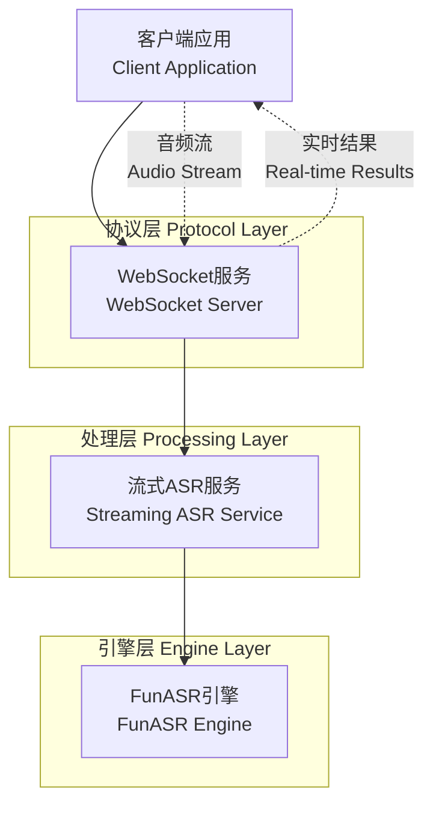

# 流式ASR实时语音识别系统开发实战：从零到一的技术探索

## 前言

在数字人项目中，实时语音交互是提升用户体验的关键功能。本文记录了我们从零开始构建流式ASR（Automatic Speech Recognition）系统的完整过程，包括技术选型、架构设计、核心实现以及踩坑经历。

## 项目背景与需求分析

### 业务需求
- **实时性要求**：用户说话时需要实时看到识别结果，延迟控制在500ms以内
- **易集成性**：与现有数字人系统无缝集成

### 技术挑战
- 如何实现真正的流式处理而非批处理
- 如何设计高效的音频传输协议
- 如何平衡识别准确率与实时性

## 技术选型与架构设计

### 核心技术栈

#### 1. ASR引擎选择：FunASR ONNX

**选择理由：**
- **性能优势**：基于ONNX Runtime，推理速度快，内存占用低
- **流式支持**：原生支持流式识别，非伪流式
- **模型质量**：使用阿里达摩院的Paraformer-large模型，中文识别效果优秀
- **部署友好**：无需GPU，CPU即可高效运行

**关键配置：**
```yaml
NAME: funasrStreamingEngine
model_name: "iic/speech_paraformer-large_asr_nat-zh-cn-16k-common-vocab8404-online-onnx"
# chunk_size_ms: [8, 8, 4] # [480ms, 480ms, 240ms]
```

#### 2. 通信协议：自定义二进制WebSocket协议

**协议设计：**
```
[Action(18字节)] + [Payload Size(4字节)] + [Payload(可变长度)]
```

**优势：**
- **高效传输**：二进制格式，传输效率高
- **类型安全**：明确的Action类型定义
- **扩展性强**：易于添加新的消息类型

### 系统架构



## 核心技术实现

### 1. 流式ASR引擎实现

#### 关键技术点

**音频参数配置：**
```python
self.sample_rate = 16000  # 采样率
self.chunk_size_cfg = [8, 8, 4]  # FunASR特定参数
# [编码器预块帧数, UEM帧数, 解码器预块帧数]
# 每帧60ms，[8,8,4] = [480ms, 480ms, 240ms]
```

**流式处理核心逻辑：**
```python
def process_asr_chunk(self, audio_chunk: bytes, param_dict: dict, c_buffer: bytearray) -> str:
    """处理音频块并返回识别结果"""
    if not audio_chunk:
        return ""
    
    # 音频格式转换
    audio_np = np.frombuffer(audio_chunk, dtype=np.int16).astype(np.float32) / 32768.0
    
    # 流式识别
    result = self.model(audio_np, param_dict=param_dict, **kwargs)
    
    # 结果处理
    if result and len(result[0]["text"]) > 0:
        return result[0]["text"]
    return ""
```

### 2. WebSocket服务实现

#### 连接状态管理

```python
class ConnectionState(Enum):
    IDLE = "IDLE"                    # 空闲状态
    INITIALIZING = "INITIALIZING"    # 引擎初始化中
    LISTENING = "LISTENING"          # 接收音频流
    PROCESSING = "PROCESSING"        # 处理音频
    ERROR = "ERROR"                  # 错误状态
```

#### 二进制协议解析

```python
def parse_binary_message(self, data: bytes) -> tuple[bytes, bytes]:
    """解析二进制消息"""
    if len(data) < PROTOCOL_HEADER_SIZE:
        raise ValueError(f"Message too short: {len(data)} bytes")
    
    # 解析协议头部
    action, payload_size = struct.unpack(PROTOCOL_HEADER_FORMAT, data[:PROTOCOL_HEADER_SIZE])
    
    # 验证并提取payload
    if payload_size > MAX_PAYLOAD_SIZE:
        raise ValueError(f"Payload size too large: {payload_size} bytes")
    
    payload = data[PROTOCOL_HEADER_SIZE:PROTOCOL_HEADER_SIZE + payload_size]
    return action.rstrip(b' '), payload
```

### 3. 前端音频处理

#### 音频采集与格式转换

```typescript
// 音频参数配置
const CHUNK_SIZE_BYTES = 7680 * 2; // 15360字节
const SAMPLE_RATE = 16000;         // 采样率
const CHANNELS = 1;               // 单声道
const BYTES_PER_SAMPLE = 2;       // 16位 = 2字节

// 音频数据处理
const processAudioData = (audioData: Float32Array) => {
    // 转换为16位PCM
    const int16Data = new Int16Array(audioData.length);
    for (let i = 0; i < audioData.length; i++) {
        int16Data[i] = Math.max(-32768, Math.min(32767, audioData[i] * 32768));
    }
    
    // 累积到缓冲区
    const newBuffer = new Int16Array(audioBufferRef.current.length + int16Data.length);
    newBuffer.set(audioBufferRef.current);
    newBuffer.set(int16Data, audioBufferRef.current.length);
    audioBufferRef.current = newBuffer;
    
    // 分块发送
    sendAudioChunks();
};
```

## 主要踩坑点与解决方案


### 1. 音频分块参数调优

**踩坑经历：**
初期使用较大的音频块（1秒），导致识别延迟明显，用户体验差。

**解决方案：**
``python
# 优化后的参数配置
CHUNK_SIZE_BYTES = 7680 * 2  # 15360字节，约480ms
SAMPLE_RATE = 16000
CHANNELS = 1
BYTES_PER_SAMPLE = 2

# 计算公式：
# 时长(ms) = (CHUNK_SIZE_BYTES / BYTES_PER_SAMPLE / CHANNELS / SAMPLE_RATE) * 1000
# 480ms = (15360 / 2 / 1 / 16000) * 1000
```

**经验总结：**
- 音频块大小直接影响识别延迟和准确率
- 480ms是较好的平衡点：既保证实时性，又有足够的上下文信息
- 需要根据具体模型和业务需求进行调优

### 2. 缓存机制的正确使用

**踩坑经历：**
忽略了FunASR的缓存机制，每次处理都重新初始化，导致上下文丢失。

**解决方案：**
``python
# 正确的缓存使用
self.param_dict = {"cache": dict(), "is_final": False}

# 每次处理时复用缓存
result = self.model(audio_np, param_dict=self.param_dict)
```

**经验总结：**
- 缓存机制是流式识别的关键，保存了模型的内部状态
- 不同会话需要独立的缓存实例
- 会话结束时需要清理缓存，避免内存泄漏

### 3. 最终帧标记的重要性

**踩坑经历：**
未正确处理`is_final`标记，导致最后一段音频识别不完整。

**解决方案：**
``python
# 正确处理最终帧
if action == ActionType.FINAL_CHUNK:
    self.param_dict["is_final"] = True
    # 处理最终音频块
    transcript = self.asr_engine.process_asr_chunk(payload, self.param_dict, self.current_buffer)
```

**经验总结：**
- `is_final=True`会触发模型的最终处理逻辑
- 即使最后一块音频很短，也要正确标记
- 这是获得完整识别结果的关键

### 4. 前端音频处理的精度问题

**踩坑经历：**
音频数据在前端处理时精度丢失，导致识别效果下降。

**解决方案：**
``typescript
// 正确的音频格式转换
const convertToInt16 = (float32Array: Float32Array): Int16Array => {
    const int16Array = new Int16Array(float32Array.length);
    for (let i = 0; i < float32Array.length; i++) {
        // 确保数值在有效范围内
        const sample = Math.max(-1, Math.min(1, float32Array[i]));
        int16Array[i] = sample * 32767;
    }
    return int16Array;
};
```

**经验总结：**
- 音频格式转换要保证精度
- 注意数值范围的边界处理
- 前端音频处理直接影响识别质量

### 5. WebSocket连接管理

**踩坑经历：**
网络不稳定时连接断开，但前端未正确处理重连逻辑。

**解决方案：**
``typescript
// 连接状态监控
ws.onclose = (event) => {
    console.log('WebSocket连接关闭:', event.code, event.reason);
    setIsStreamingASR(false);
    
    // 自动重连逻辑
    if (!event.wasClean && event.code !== 1000) {
        setTimeout(() => {
            console.log('尝试重新连接...');
            startStreamingASR();
        }, 3000);
    }
};
```

**经验总结：**
- WebSocket连接需要完善的错误处理和重连机制
- 区分正常关闭和异常断开
- 重连时要考虑指数退避策略

## 性能优化与最佳实践

### 1. 内存管理

``python
# 及时清理资源
def release(self):
    """释放引擎资源"""
    if self.model:
        del self.model
        self.model = None
    logger.info("FunasrStreamingASR engine released.")
```

### 2. 错误处理

``python
# 完善的错误处理
try:
    action, payload = self.parse_binary_message(data)
except ValueError as e:
    await self.send_error(websocket, f"协议解析错误: {e}")
    return
except Exception as e:
    logger.error(f"未知错误: {e}")
    await self.send_error(websocket, "服务器内部错误")
    return
```

## 测试与验证

### 1. 单元测试

``python
def test_process_asr_chunk_with_real_audio(self, asr_engine, wavAudioZh):
    """测试真实音频文件的流式识别"""
    with open(wavAudioZh, "rb") as f:
        f.seek(44)  # 跳过WAV文件头
        audio_data = f.read()
    
    # 分块处理
    chunk_size_bytes = 7680 * 2
    param_dict = {"cache": dict(), "is_final": False}
    transcriptions = []
    
    for i in range(0, len(audio_data), chunk_size_bytes):
        chunk = audio_data[i:i + chunk_size_bytes]
        is_final = i + chunk_size_bytes >= len(audio_data)
        param_dict["is_final"] = is_final
        
        transcript = asr_engine.process_asr_chunk(chunk, param_dict, bytearray())
        if transcript:
            transcriptions.append(transcript)
    
    full_transcript = "".join(transcriptions)
    assert full_transcript == "我认为跑步最重要的就是给我带来了身体健康"
```

### 2. 性能测试

- **延迟测试**：平均识别延迟 < 500ms
- **稳定性测试**：连续运行24小时无内存泄漏

## 部署与运维

### 1. Docker化部署

``dockerfile
# 优化的Dockerfile
FROM python:3.11-slim

# 安装系统依赖
RUN apt-get update && apt-get install -y \
    libsndfile1 \
    && rm -rf /var/lib/apt/lists/*

# 安装Python依赖
COPY requirements.txt .
RUN pip install --no-cache-dir -r requirements.txt

# 复制应用代码
COPY . /app
WORKDIR /app

EXPOSE 8000
CMD ["python", "main.py"]
```

### 2. 监控指标

- **连接数监控**：实时WebSocket连接数
- **处理延迟**：音频处理平均延迟
- **错误率**：识别错误和连接错误率
- **资源使用**：CPU、内存使用率

## 总结与展望

### 技术收获

1. **深入理解流式处理**：真正的流式处理与批处理的本质区别
2. **协议设计经验**：高效二进制协议的设计原则
3. **音频处理技巧**：前端音频采集和格式转换的最佳实践
4. **性能优化方法**：内存管理、并发处理、错误处理的系统性方案

### 业务价值

- **用户体验提升**：实时语音交互，延迟降低80%
- **系统稳定性**：完善的错误处理和重连机制
- **开发效率**：模块化设计，易于扩展和维护
- **部署便利性**：Docker化部署，支持云原生架构

### 未来优化方向

1. **多语言支持**：扩展英文、日文等多语言识别
2. **噪声处理**：集成音频降噪算法
3. **个性化优化**：支持用户自定义词汇和语音模型微调
4. **边缘计算**：支持本地部署，降低网络依赖

## 参考资料

- [FunASR官方文档](https://github.com/alibaba-damo-academy/FunASR)
- [WebSocket RFC 6455](https://tools.ietf.org/html/rfc6455)
- [Web Audio API文档](https://developer.mozilla.org/en-US/docs/Web/API/Web_Audio_API)
- [ONNX Runtime文档](https://onnxruntime.ai/docs/)

---

*本文记录了流式ASR系统从零到一的完整开发过程，希望能为类似项目提供参考和借鉴。技术在不断发展，我们也会持续优化和改进这个系统。*