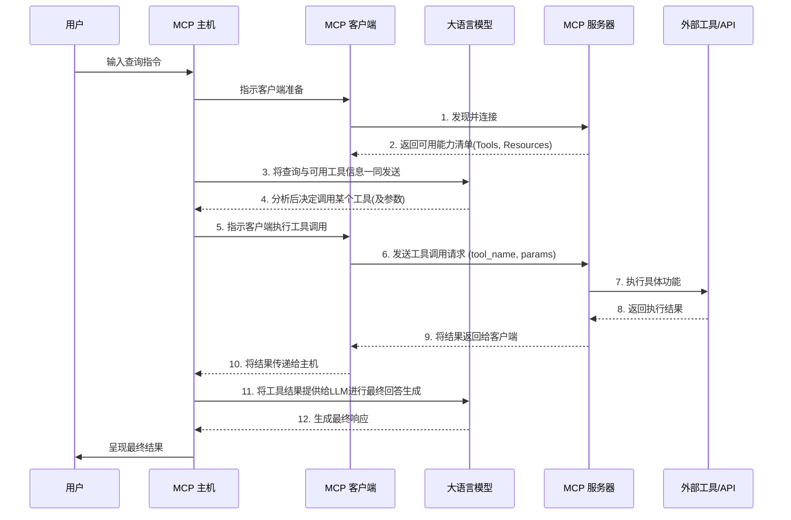

<div style="background: linear-gradient(135deg, #667eea 0%, #764ba2 100%); padding: 20px; border-radius: 12px; text-align: center; margin: 25px 0; box-shadow: 0 8px 32px rgba(102, 126, 234, 0.3);">
  <h3 style="color: white; margin: 0 0 15px 0; font-size: 20px;">🎯 交互式学习体验</h3>
  <p style="color: rgba(255,255,255,0.9); margin: 0 0 20px 0; font-size: 16px;">包含可视化图表、代码示例、悬停提示和一键复制功能</p>
  <a href="/interactive-guides/mcp-fastmcp-guide.html" 
     style="display: inline-block; padding: 14px 28px; background: rgba(255,255,255,0.2); color: white; text-decoration: none; border-radius: 8px; font-weight: 600; font-size: 16px; border: 2px solid rgba(255,255,255,0.3); transition: all 0.3s ease; backdrop-filter: blur(10px);"
     target="_blank"
     onmouseover="this.style.background='rgba(255,255,255,0.3)'; this.style.transform='translateY(-2px)'; this.style.boxShadow='0 6px 20px rgba(0,0,0,0.2)'"
     onmouseout="this.style.background='rgba(255,255,255,0.2)'; this.style.transform='translateY(0)'; this.style.boxShadow='none'">
    🚀 立即开始懒人版阅读
  </a>
</div>

# 硬核指南：剖析模型上下文协议(MCP)与FastMCP框架


在大型语言模型（LLM）与外部世界交互的探索中，我们曾长期处于一个“蛮荒时代”。开发者为每一个AI应用与外部工具的连接定制API、处理复杂的JSON、艰难地维护状态……这不仅是重复劳动，更构建了一个个技术孤岛，阻碍了整个AI生态的互操作性。

本文旨在超越浅尝辄止的介绍，深入剖析旨在终结这一乱象的优雅解决方案：**模型上下文协议（Model Context Protocol, MCP）**，及其旗舰级Python实现——**FastMCP**。我们将从其核心设计哲学出发，一直探讨到生产环境中的高级架构模式与安全考量。

## MCP：重塑AI集成的架构基石

要理解MCP的革命性，必须直面其旨在解决的核心痛点：随着AI应用需要集成的工具增多，系统复杂度呈指数级增长。过去，每个应用与每个工具的连接都需要定制开发，形成了一个脆弱且难以维护的“N对M”网状连接。MCP的诞生，正是为了用架构的优雅来终结这种工程上的混乱。

**MCP的核心价值，在于通过引入一个标准化的协议层，将这个集成问题从根本上转变为一个更易于管理的“N对1对M”模式。**

这好比用USB-C标准统一了所有设备的充电和数据接口。开发者不再需要关心“另一端”是哪个具体的LLM或应用，他们只需构建一个遵循MCP标准的、可复用的服务。这种架构上的解耦是其核心创新，它为构建一个可复用、可扩展的AI工具生态系统奠定了基础。

### MCP 的核心工作流程

MCP定义了三个核心角色，它们的协作构成了协议的骨架：

1. **MCP 主机 (Host)**：用户直接交互的应用，如IDE或AI聊天客户端。它扮演“指挥中心”的角色，协调整个交互流程。

2. **MCP 客户端 (Client)**：嵌入在主机内，是通信的执行者。它负责与服务器建立连接并根据协议交换信息。

3. **MCP 服务器 (Server)**：开发者构建的核心组件，是一个轻量级程序，负责将具体的功能（如代码执行、API调用）通过MCP标准暴露给客户端。

下面这个流程图更精确地展示了它们之间的交互细节：



## FastMCP：从协议到生产力

**FastMCP**是MCP协议的旗舰级Python实现。它借鉴FastAPI的设计哲学，通过强大的自动化和“约定优于配置”原则，让开发者能以极高效率构建健壮的MCP服务。

其核心魅力在于，开发者只需使用标准的Python函数、类型提示和文档字符串，FastMCP就能自动完成所有繁重工作，包括生成协议模式(Schema)、请求解析、数据验证，并提供强大的开发工具。

### FastMCP核心组件：从基础到高级的生产力工具

掌握基础之后，我们必须深入了解FastMCP提供的更强大的构建模块，这才是其被称为‘生产力工具’的真正原因。

* **`Context` 对象**：这不仅仅是一个参数，更是服务器端能力的接口。它会自动作为第一个参数传递给工具函数，并提供：

  * **日志记录**: `ctx.info()`

  * **进度报告**: `ctx.report_progress()`，用于向客户端报告长时间运行任务的进度。

  * **内部资源访问**: `await ctx.read_resource(uri)`，允许在一个工具内部调用另一个资源。

  * **双向AI交互 (采样)**: `await ctx.sample(...)`，这是一个高级功能，允许你的工具**反向请求**连接的LLM客户端进行文本补全，实现了服务器与AI之间的双向通信。

* **Pydantic集成**：当工具需要复杂的结构化输入时，可以直接使用Pydantic模型作为类型提示。FastMCP会自动将其转换为JSON Schema，极大地简化了复杂参数的处理。

* **多种传输协议**：FastMCP不局限于单一的通信方式，支持多种传输协议以适应不同部署场景，包括：

  * **STDIO**: 默认选项，适合本地命令行工具。

  * **Streamable HTTP / SSE**: 推荐用于Web部署，兼容性好。

  * **WebSocket**: 提供持久的双向连接，适用于需要实时通信的应用。

### 快速上手代码示例

为了展示这些高级组件的实际用途，让我们设想一个场景：你需要开发一个工具来处理上传的大型视频文件。这个任务耗时很长，需要向用户报告进度，并且其处理参数（如分辨率、编码格式）由另一个配置资源提供。下面的例子就模拟了这种情况：

```python
# advanced_server.py
from fastmcp import FastMCP, Context
from pydantic import BaseModel
import time

# 1. 实例化服务器
mcp = FastMCP(name="高级数据处理应用")

# 定义一个复杂的输入模型
class DataProcessingRequest(BaseModel):
    source_uri: str
    iterations: int

# 2. 定义一个使用Context和Pydantic模型的工具
@mcp.tool()
async def process_data(ctx: Context, request: DataProcessingRequest) -> dict:
    """
    一个模拟长时间运行的数据处理任务。
    它会读取一个资源，并报告进度。
    """
    ctx.info(f"开始处理来自 {request.source_uri} 的数据...")
    
    # 使用Context访问其他资源
    try:
        source_data = await ctx.read_resource(request.source_uri)
    except Exception as e:
        ctx.error(f"读取资源失败: {e}")
        return {"status": "error", "message": "无法读取源数据"}

    for i in range(request.iterations):
        # 模拟工作
        time.sleep(0.5)
        # 使用Context报告进度
        ctx.report_progress(current=i + 1, total=request.iterations)
    
    ctx.info("数据处理完成。")
    return {"status": "success", "processed_items": len(source_data)}

# 3. 定义一个被上面工具使用的资源
@mcp.resource("data://sample_data")
def get_sample_data() -> list:
    """提供一些示例数据。"""
    return ["item1", "item2", "item3"]

# 4. 运行服务器 (在终端中使用 `fastmcp dev advanced_server.py` 启动)
if __name__ == "__main__":
    mcp.run()
```

## 高级架构与安全考量

当应用从原型走向生产时，必须考虑更复杂的架构和安全问题。MCP生态系统对此提供了成熟的解决方案。

### 架构模式：服务器组合与代理

FastMCP 2.0引入了强大的微服务架构能力。开发者可以将多个独立的MCP服务器 **组合(Composition)** 成一个统一的应用程序，或者 **代理(Proxy)** 一个已有的服务器以修改或增强其行为。这使得构建复杂、模块化、易于维护的大型AI系统成为可能。

### 生态集成：从现有API快速生成

为了加速MCP的采纳，社区开发了从现有API快速生成MCP服务器的“桥梁”工具，极大地降低了迁移成本：

* **`fastapi-mcp`**: FastAPI的原生扩展，只需几行代码就能将所有FastAPI端点直接暴露为MCP工具，并完整保留原有的数据模式和API文档。

* **OpenAPI (Swagger) 生成器**: 存在一些工具可以将任何遵循OpenAPI规范的REST API自动包装成MCP服务器，让LLM能立即使用海量的现有Web服务。

### 生产环境中的安全

安全性是生产环境的重中之重。

* **认证**: FastMCP 2.0内置了对`auth`的支持，可以轻松保护服务器端点和验证客户端身份。

* **运行时保护**: 社区开发了如`pyrasp`等工具，为MCP服务器提供运行时应用自我保护（RASP）功能。

* **安全即工具**: 更有项目将Nmap、SQLMap等流行的安全测试工具包装成MCP工具，从而实现了由AI驱动的、自动化的渗透测试工作流。

## 结论：从标准化迈向智能化

MCP和FastMCP不仅仅是又一个技术框架，它们代表了一种架构思想的演进。通过解耦、标准化和可复用性，它们成功地将复杂的点对-点集成问题，转化为一个统一、易于管理的模式，从而培育出一个繁荣的、跨语言的生态系统。

当我们展望一个AI智能体更深度融入关键业务流程的未来时，这种架构的重要性将愈发凸显。本文所探讨的`Context`对象、服务器组合、生态集成与安全实践，是构建下一代可靠、可扩展、智能化AI应用的基石。对于任何严肃的AI应用开发者而言，现在就深入理解并掌握MCP，不仅是解决当前问题的良方，更是对未来竞争力的战略投资。


**准备好了吗？** [点击这里复习你的MCP学习之旅](/interactive-guides/mcp-fastmcp-guide.html) 🎯
