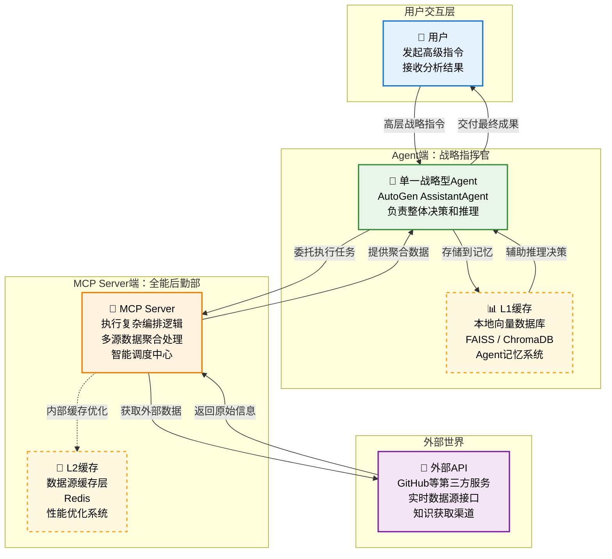

# 超越工具：构建企业级AI Agent的MCP架构哲学 

## 引言：一次反思之旅

我们的探索始于一个简单的问题：“一个 MCP 工具应该有多少参数？” 这个问题，如同一块投入湖中的石子，激起了一连串更深层次的涟漪。我们从工具设计的战术细节，走向了 Agent 架构的战略思考；从如何划分功能，走向了如何定义 Agent 的本质。

这篇文档，是我们这场深度对话与反思的结晶。它不再是一个简单的“最佳实践”列表，而是一套经过反复诘问和推演后沉淀下来的**架构哲学**。它旨在回答一个核心问题：如何构建一个真正智能、高效、健壮且可扩展的 AI Agent 系统？

我们将直面那些在初步设计中看似合理、实则脆弱的“反模式”，并提出一个我们称之为“github tool best pratice”的最终架构范式。

## 第一章：反思的结晶 - 从“微操”到“委托”的核心转变

在我们最初的讨论中，一个潜在的、危险的设计模式反复出现：**让 Agent 成为一个“微操大师”**。

在这种模式下，Agent 亲自下场，指挥着一系列原子化的 `Tool`，进行着“话痨式”的交互：
1. “Server，给我用户 Star 列表的第一页。”
2. “Server，这是第一页的结果，现在去获取这10个仓库的详情。”
3. “Server，很好，现在去拿第二页列表...”

这种模式是**致命的**，因为它：
* **创造了糟糕的用户体验**：用户面对的是一个频繁卡顿、延迟叠加的系统。
* **带来了高昂的隐性成本**：每一次网络往返都消耗着时间、Token 和计算资源。
* **构建了脆弱的流程**：这个由几十上百步组成的调用链，任何一环出错，整个任务都会失败。Agent 被迫处理极其复杂的重试和状态管理逻辑。

**核心的思维转变在于，我们必须将 Agent 的角色从“微操大师”转变为“战略指挥官”。** Agent 的核心价值在于**理解意图、进行推理、做出决策**，而不是管理程序化的循环。

因此，我们必须将复杂的、多步骤的**编排逻辑（Orchestration）**，从 Agent 端**下沉（Sink）到 MCP Server 端。Agent 的指令应该从“你去做A，然后用A的结果去做B...”转变为一个清晰的战略委托**：“我需要一份关于这个主题的完整分析报告，你去搞定它。”

## 第二章：最终架构范式：“战略指挥官-全能后勤部”模型

基于上述核心转变，我们提出了一个更成熟、更健壮的“v3”架构。



这个模型包含两个核心部分：

1. **Agent 端 (战略指挥官)**:
   * **单一、职责明确的 Agent**: 只有一个核心 Agent。它的任务是理解用户的高层、甚至模糊的意图。
   * **战略委托者**: 它不执行具体的、繁琐的数据拉取任务。相反，它调用 MCP Server 提供的**高级 `prompt`** 来完成复杂的、需要编排的工作流。
   * **本地知识中心**: 它维护着自己的 L1 缓存（向量数据库），用于存储从 Server 获取的、经过处理的数据。所有的分析、推理、语义搜索都在这个“本地大脑”中高速完成。

2. **MCP Server 端 (全能后勤部)**:
   * **原子化 `Tool` 的提供者**: Server 依然提供细粒度的 `Tool`，用于简单的、一次性的操作。
   * **复杂工作流的执行者**: Server 的核心价值体现在它提供的**高级 `prompt`** 上。例如 `create_starred_repo_analysis_bundle`，它封装了所有的数据获取、循环、并发调用和聚合逻辑。
   * **数据源的守护者**: Server 管理着 L2 缓存（如 Redis），负责保护后端 API、处理速率限制，并为 Agent 提供快速、可靠的数据源。

## 第三章：多 Agent 架构的“正确打开方式”（及常见误区）

一个常见的误区是认为“Agent 越多越强大”。这导致了诸如“FetcherAgent 获取数据，再发给 AnalyzerAgent 分析”的脆弱流水线设计。

**那么，什么时候才真正需要引入多个 Agent？**

多 Agent 架构适用于需要**多种异构专长协作**的场景，就像组建一个人类专家团队。

**正确的多 Agent 场景示例：一个“创业策划 Agent”**

1. **`ManagerAgent` (项目经理)**: 接收用户的高层指令：“为我策划一个 AI 主题的咖啡馆。”
2. `ManagerAgent` 将任务分解，并**并行委托**给拥有不同技能的专家 Agent：
   * **`MarketAnalysisAgent`**: “分析目标区域的咖啡市场、竞争对手和潜在客户画像。”
   * **`FinancialPlannerAgent`**: “估算启动成本、设计定价策略，并预测未来三年的现金流。”
   * **`LegalComplianceAgent`**: “研究开设餐饮企业所需的全部证照、卫生标准和劳动法规。”
   * **`BrandDesignAgent`**: “设计品牌 Logo、菜单风格和室内装修概念。”
3. 所有专家 Agent 完成各自的任务后，将结构化的报告返回给 `ManagerAgent`。
4. `ManagerAgent` **汇总、整合**所有报告，最终生成一份完整、专业的商业计划书，并呈现给用户。

在这个场景中，每个 Agent 都代表一种**不可替代的、专业的、异构的能力**。它们的协作是并行的、非线性的，最终由一个管理者来整合。这与我们案例中的线性数据处理流程有着本质的区别。

## 第四章：与 AutoGen 的优雅结合

在“指挥官-后勤部”模型下，AutoGen 框架可以被非常优雅地应用，避免陷入多 Agent 流水线的误区。

* **`UserProxyAgent`**: 依然作为用户的直接交互接口，它负责接收用户的输入，并执行由其他 Agent 返回的代码或调用。
* **`AssistantAgent` (或自定义的 `CommanderAgent`)**: 这就是我们的**单一战略指挥官**。
  * **关键点**：这个 Agent **不应该**被配置为与其他“工人 Agent”（如 FetcherAgent, AnalyzerAgent）对话。
  * 相反，我们应该使用 `register_function` 方法，将**调用 MCP Server 的能力**注册给这个 Agent。

**代码框架示例:**
```python
# 伪代码，演示核心思想
import autogen
from my_mcp_client import MCPClient # 你自己的 MCP 客户端

# 初始化 MCP 客户端，连接到“全能后勤部”
mcp_server_client = MCPClient(server_url="...")

# 定义 Agent 调用 MCP Server 的函数
def create_analysis_bundle(username: str) -> str:
    """
    Triggers the end-to-end workflow on the MCP Server to fetch, process,
    and aggregate all starred repository data for a given user.
    Returns a structured data bundle ready for analysis.
    """
    # 这一个函数调用，取代了之前几十上百次的来回通信
    result = mcp_server_client.call_prompt(
        "create_starred_repo_analysis_bundle",
        params={"username": username}
    )
    return result # 返回聚合后的数据包

# --- AutoGen 配置 ---
llm_config = {"config_list": config_list}

# 指挥官 Agent
commander_agent = autogen.AssistantAgent(
    name="CommanderAgent",
    system_message="You are a strategic AI assistant. Your job is to understand user needs and delegate complex data operations to the MCP Server.",
    llm_config=llm_config,
)

# 用户代理
user_proxy = autogen.UserProxyAgent(
    name="UserProxy",
    human_input_mode="TERMINATE",
    code_execution_config=False, # 通常分析任务不需要执行代码
    # 将调用 MCP 的函数映射给 UserProxy，由它代为执行
    function_map={
        "create_analysis_bundle": create_analysis_bundle,
    }
)

# 发起对话
user_proxy.initiate_chat(
    commander_agent,
    message="Please create a full analysis bundle for my starred repositories. My username is 'aaronzjc'."
)
```

在这个架构中，`CommanderAgent` 的推理核心会决定调用 `create_analysis_bundle` 函数，而这个函数调用被 `UserProxyAgent` 执行，从而与 MCP Server 交互，实现了清晰、高效的职责分离。

## 第五章：终极演进路线图 (Todo List)

#### ✅ **第一阶段：MVP - 奠定坚实基础**
* **MCP Server 端 (后勤部)**:
  * \[ \] 实现原子化的 `Tool`: `get_starred_repo_list` 和 `get_batch_repo_details`。
  * \[ \] 实现 L2 缓存：使用最简单的**文件缓存**。
  * \[ \] **\[核心\]** 实现第一个高级 `Prompt`: `create_starred_repo_analysis_bundle`，封装完整的编排逻辑。
* **Agent 端 (指挥官)**:
  * \[ \] 构建单一的 `CommanderAgent`。
  * \[ \] 实现调用 `create_starred_repo_analysis_bundle` 的能力。
  * \[ \] 收到数据包后，进行简单的、基于关键词的内存分析和展示。

#### ✅ **第二阶段：成长阶段 - 引入智能与效率**
* **MCP Server 端 (后勤部)**:
  * \[ \] 将 L2 缓存方案升级到 **Redis**，提升高并发下的性能。
  * \[ \] 增加对 `Resource` 的支持，用于暴露用户配置等静态信息。
  * \[ \] 优化 `Prompt` 的内部执行逻辑，例如使用并发 IO (`asyncio`) 来加速 API 调用。
* **Agent 端 (指挥官)**:
  * \[ \] **\[核心\]** 引入本地**向量数据库 (FAISS/ChromaDB)** 作为 L1 缓存。
  * \[ \] 开发“数据同步/索引”流程：调用 `Prompt` 获取数据包，然后将其处理并存入本地向量库。
  * \[ \] 将核心分析逻辑升级为基于**语义搜索**。

#### ✅ **第三阶段：企业级阶段 - 追求健壮与专业**
* **MCP Server 端 (后勤部)**:
  * \[ \] 增加详细的日志、监控和告警。
  * \[ \] 引入基于角色的访问控制 (RBAC) 或 OAuth，对 `Tool` 和 `Prompt` 的调用进行权限管理。
  * \[ \] 提供一个管理后台，用于手动清除缓存、查看 API 调用统计等。
* **Agent 端 (指挥官)**:
  * \[ \] 开发**后台自动同步**机制，定期或通过 Webhook 触发，保持 L1 缓存的新鲜度。
  * \[ \] 优化 LLM 的 Prompt Engineering，使其能够根据向量搜索的结果，生成更复杂、多维度的分析报告。
  * \[ \] 考虑引入**异构专家 Agent**（如前述例子），由主 `CommanderAgent` 在需要时进行委托，处理真正需要不同专业技能的子任务。

## 第六章：结语

从工具到 Agent，再到多 Agent 系统，我们所追求的不应是形式上的复杂性，而应是架构上的**清晰、健壮与高效**。通过将 Agent 定位为“战略指挥官”，将 MCP Server 打造为“全能后勤部”，我们构建了一个职责分明、性能卓越的系统。

核心在于**对复杂性的有效管理**——将编排的复杂性“下沉”到 Server，让 Agent 专注于推理和决策的复杂性。这不仅是构建一个更好的 GitHub 分析工具的方法论，更是通往下一代企业级 AI 应用的坚实道路。